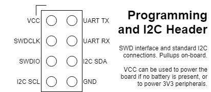
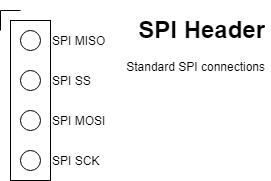

# RIOT Setup

* Install and set up [git](https://help.github.com/articles/set-up-git/)
* Install the build-essential packet (make, gcc etc.). This varies based on the operating system in use.
* Install [Native dependencies](https://github.com/RIOT-OS/RIOT/wiki/Family:-native#dependencies)
* Install [OpenOCD](https://github.com/RIOT-OS/RIOT/wiki/OpenOCD)
* Install [GCC Arm Embedded Toolchain](https://launchpad.net/gcc-arm-embedded)
* On OS X: install [Tuntap for OS X](http://tuntaposx.sourceforge.net/)
* [additional tweaks](https://github.com/RIOT-OS/RIOT/wiki/Board:-Samr21-xpro) necessary to work with the targeted hardware (ATSAMR21/30)
* Install `netcat` with IPv6 support (if necessary)

  ```bash
  sudo apt-get install netcat-openbsd
  ```

## Installing the Arm toolchain

The steps found [Here](http://watr.li/samr21-dev-setup-ubuntu.html) can be useful to help installing the toolchain. Alternatively, the following script can be run to install the toolchain.

```
ARM_URLBASE=https://developer.arm.com/-/media/Files/downloads/gnu-rm
ARM_URL=${ARM_URLBASE}/9-2019q4/gcc-arm-none-eabi-9-2019-q4-major-x86_64-linux.tar.bz2
ARM_MD5=fe0029de4f4ec43cf7008944e34ff8cc
ARM_FOLDER=gcc-arm-none-eabi-9-2019-q4-major

echo 'Installing arm-none-eabi toolchain from arm.com' >&2 && \
mkdir -p /opt && \
curl -L -o /opt/gcc-arm-none-eabi.tar.bz2 ${ARM_URL} && \
echo "${ARM_MD5} /opt/gcc-arm-none-eabi.tar.bz2" | md5sum -c && \
tar -C /opt -jxf /opt/gcc-arm-none-eabi.tar.bz2 && \
rm -f /opt/gcc-arm-none-eabi.tar.bz2 && \
echo 'Removing documentation' >&2 && \
rm -rf /opt/gcc-arm-none-eabi-*/share/doc
# No need to dedup, the ARM toolchain is already using hard links for the duplicated files

export PATH:/opt/${ARM_FOLDER}/bin
```

## Installing OpenOCD

Navigate to the [OpenOCD](../openocd) folder. 
Process is something like: 

```bash 
./bootstrap 
./configure -- enable-ftdi 
make all 
sudo make install 
``` 

See the README within the directory for more detailed information. Potential fixes for common issues can be found [here](https://github.com/RIOT-OS/RIOT/wiki/OpenOCD). A common one is LIBUSB_ERROR_ACCESS. In openocd/contrib, there should be a `.rules` file called something like `60-openocd.rules`. This can be copied to your udev rules directory (/etc/udev/rules.d/), which should fix this issue.

## Building and flashing the programs

Each program can be built and run using the standard RIOT make flow. First, enter the folder you want to build. Next you can either build the files first with `make all` or build and flash with `make flash`. When multiple boards are connected to a single computer, it is neccessary to specify the serial number of the board you want. This can be accessed with `make list-ttys` and the number from this used like `make flash SERIAL=xxx`.

If building on a non-standard piece of hardware, the term BOARD can also be added to the command i.e. `make flash SERIAL=xxx BOARD=samr30-xpro` to build the code for the nodes for the SAMR30 Xplained-Pro boards.

To enter the terminal, `make term SERIAL=xxx` can then be used.

### Connecting to the node's headers

The table below shows the connections between the FTDI cable and the board. The 470ohm resistor should be replacable with any resistor between 220 and 470ohm.

|Num	|FTDI/C232HM Color	|JTAG Func  |Connection     |
|---  |---                |---        |---            |
|1    |Red	              |VCC        |VCC (optional) |
|2	  |Orange             |TCK        |SWCLK          |
|3    |Yellow             |TDI        |470ohm resistor to SWDIO|
|4    |Green              |TDO        |SWDIO          |
|5    |Brown              |TMS        |NC             |
|6    |Grey               |GPIOL0     |NC             |
|7    |Purple             |GPIOL1     |NC             |
|8    |White              |GPIOL2     |NC             |
|9    |Blue               |GPIOL3     |NC             |
|10 	|Black              |GND 		    |GND            |

The headers on board are shown below:

 &nbsp;   &nbsp;   &nbsp;   &nbsp; 


